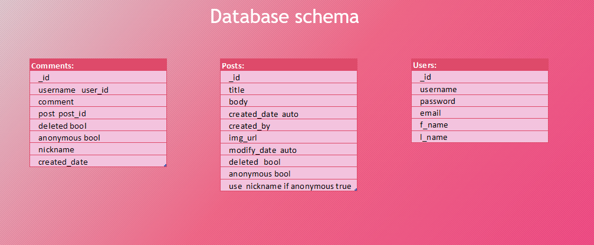

# Positively Pink

<brief about the project>

  

 
### :point_right: [Live demo](http://positively-pink.herokuapp.com/)
 
## Table of Contents
 
- [About](#About)
- [User Experience (UX)](#User-Experience-(ux))
  - [User Stories](#User-Stories)
  - [UI](#ui)
  - [Design](#Design)
  - [Database Model](#database-model)
  - [Wireframes](#Wireframes)
- [Features](#Features)
    - [Future features](#Future-updates)
- [Technologies used](#Technologies-used)
- [Testing](#Testing)
    - [Manual testing](#Testing)
- [Errors](#Errors)
- [Code Notes](#Code-Notes)
- [Deployment](#Deployment)
- [Credits](#Deployment)
    - [Code](#Code)
     - [Images](#Images)
- [Acknowledgements](#Acknowledgements)

---
## About
Awareness surrounding breast cancer is incredibly important as breast cancer is the most commonly diagnosed cancer in women all over the world. It helps people to recognize early signs and symptoms and remove the stigma and fear attached. 

This site offers a room where anyone with experience of breast cancer to share their story and find comfort in reading others.
It aims to raise breast cancer awareness and help create a world full of survivors by ensuring women win every time..

---

## User Experience (UX)

### User Stories

#### As a first time user I want to be able to:

* Understand easily what the site is about and be able to navigate it intuitively. 
* Get information about what I can do to reduce the risk of severe breast cancer.
* Read other peoples stories without needing to register to find support in a tough situation.
* Easily register to the website and log in to be able to write my own post.
* Find links to other useful sources and websites.

#### As a returning user I want to be able to:

* Log in to the website using my username and password.
* Read newly added posts by other users.
* Access My Account to be able to browse my posts, add new ones and edit/delete existing ones.
* Add comments to other people's posts.

#### As an owner / admin of the website I want to be able to:
* Monitor and regularly update the website.
* Delete entries contributed by registered users if necessary.

**[back to top](#About)**

### Scope
* To create a user friendly website using HTML, CSS, JavaScript, Python, Flask and MongoDB that ensures continuous, intuitive and fluid experience for the users.
* To promote breast cancer awareness and provide a space for users where they can access important information, share personal stories, get and offer support to others in silmilar situation.

### Structure
This website offers users the option to choose between the following two to accomodate their individual preferences:

* First-time users - (unauthenticated site visitors) can access selected functions in the navigation panel: Home, Blog, Log In and Sign Up Pages.
* Registered users - once users decide to register to the website, they will be able to access full functionality and additionally access My Account page with Browse My Stories and Add Story feature.

### Design Choices 

- [x] **Color Scheme**
* The color palette was created using [Coolors]() and custom color classes were used in this project.

- [x] **Typography**
* *Saira* was used for brand logo and headings to give the site contemporary feel.
* *Noto Sans* for the all other elements as we found it complemented well the above font. 

- [x] **Imagery**
* The Home page supporting images were added to enchance the overall experience and were obtained from [Pexels](https://www.pexels.com/).

### Wireframes
Wireframes provided were created at the planning stage of this project. While building the project, we decided to add some additional features. The added extra features are: users are able to Add, View, Edit and Delete Comments and edit their profile information. 
  * **[Wireframes](static/img/BosomBuddies.pdf)**

**[back to top](#About)**

### Database Model

  * The diagram below shows the relationship between fields of the existing database collections. We kept it simple as we wanted it to be compact and serve it's purpose of displaying a relationship between registered users, their added posts and comments. 

  * [Database schema] screenshot

  

 
---

## Features

### Implemented Features

- [x] **Features available to all users and admin**

**Home Page**

* **Navigation Bar**
  * Responsive Navigation Bar was created using Bootstrap Navbar. It displays the website's logo / brand-name on the left and on the right navigation links to the "Home", "Blog", "Health Check", "Log In" and "Sign Up" Pages when the user is not logged in. 
  * LOgged In users also able to see "Profile" and "Log Out" links. 
  * Brand Logo also serves as link to the Home Page, which is particularly convenient when accessing the site on smaller screen size devices. 
  * On screen sizes below 992px navbar is hidden and slide out menu comes into effect, which collapses into a hamburger menu bar when closed. 

* **Hero Image and Title**
  * A background hero image was added to visually support the content and for added user interactivity. 

* **About Section**
  * This section consists of a title and a paragraph text that explains the purpose of the website and call for action buttons. 

* **Know the Signs and Your Stories sections**
  * This sections are made of two Bootstrap cards. 'Read More' buttons take users to the appropriate pages and to read the whole content. The first panel invites users to learn to recognize signs and the symptoms and the second one guides users to the Blog Page to browse all stories. 

* **Health Check**
    * This section is created using Bootstrap accordion component and contains some information on Breast Cancer and useful links for those who want to find out more. 

* **Footer**
  * Designed using Bootstrap Footer component, contains hoverable Social Media icons to let users know they are clickable. Icons are linked to the external websites and open in new tabs when clicked. Available accross all pages.
  * Copyright section is directly below the Footer and contains Copyright information.

**Blog Page**

* **Browse All Results**
* By default, the Blog page displays all posts shared by users and comments left under each post  allowing users to scroll down to browse. 

**Log In Page**
* Contains a Bootstrap card with the required input fields for Username and Password. It allows registered users to log in to the account and to access additional features. 
* The page also contains a link to the Sign Up page. 

**Sign Up**
* Similar to the page above it contains a card with the Username, email, Password and Confirm password input fields and enables new users to create a personalized account and to be able to post stories to the site. 
* There is a link below the card to re-direct already registered users to the Log In page. 

- [x] **Features available to registered users and admin**

**Add Story**
* The form allows users to add new post title and post text (Create functionality).
* If post is added to successfully users see a flash message to confirm the successful entry. This post is then displayed in the users' Account Page. 

**Add Comment**
* The form allows users to add new comment title and comment text (Create functionality).

**Account Page**
* The Account page displays the posts history shared by the user (Read functionality). 
* Font awesome icons are placed below each entry, providing an option to edit (Update functionality) or delete the term (Delete functionality).
* Admin user is authorized to delete entries made by other users, if they are deemed irrelevant or inapropriate.

**Log Out**
* Enables users to log out of their account and deletes their session cookies. 

### Future Features 
* Add pagination to the Blog Page for easier navigation and better user experience as the content grows.

**[back to top](#About)**

---
 
## Technologies used

Below I have listed the programming languages, technologies, frameworks and resources used for this project.
 
* **HTML5**
* **CSS3**
* **Vanilla JS**
* **jQuery**
* **Markdown**
* **Git** for version control.
* **Github** to hold my project.
* **Heroku** to deploy my project to the web.
* **Flask** - a lightweight micro web framework written in Python used to create a simple, clean code and to reduce development time.
* **MongoDB** - non-relational database, used to store, manipulate and retrieve data.
* **Google Chrome/FireFox/Edge/Safari** 
* **Developer tools for chrome/FireFox/Edge**
* **[Amiresponsive](http://ami.responsivedesign.is/)**
* **[Balsamiq](https://balsamiq.com/)** to create wireframes.
* **[W3Schools](https://www.w3schools.com/)** for help with some issues I ran into
* **[StackOverFlow](https://stackoverflow.com/)** for help with some issues I ran into
* **[Slack](https://slack.com/)** to communicate and collaborate with the team members.
* **[Grammarly](https://www.grammarly.com/)** to correct grammar and spelling mistakes.
* **3D Paint** to manipulate the hero image.

---

## Testing

* [HTML validator](https://validator.w3.org/#validate_by_input)
  * [No issues](readme_screenshots/html_validator.png)
* [CSS validator](https://jigsaw.w3.org/css-validator/#validate_by_input)
 
* [JsHint](https://jshint.com)

* Testing [checklist](https://geteasyqa.com/qa/test-website/)
* [pep8](http://pep8online.com/)

I personally tested the website on some of my own personal systems of which include:
1. Windows10 Google Chrome, Mozilla, Edge browsers
2. [https://www.webpagetest.org/](https://www.webpagetest.org/) To test for errors and performance 

      
### Manual testing

---

Detail testing

1
2
3
No automated testing was conducted.

---

User stories testing

1.
2.
3.

---

### Errors

Current errors:

1.
2.
3.

---

## Code Notes

---

## Deployment

Deployment

To deploy this project I used [Heroku](https://dashboard.heroku.com/)

**The final version of the application was deployed using Heroku:**   
**[here](https://positively-pink.herokuapp.com/)**

The deployed version is the same version as in the repository.

The following steps were used for deployment on Heroku:

1. In Gitpod CLI, in the root directory of the project, run 

   `pip3 freeze --local > requirements txt`

   to create a `requirements.txt` file containing project dependencies.

2. In the Gitpod project workspace root directory, create a new file called Procfile, with capital 'P'.  
   Open the Procfile. Inside the file, enter:  

   `web: python3 app.py`

    Save the file.

3. **Make sure you do a Git commit after creating the requirements.txt and the Procfile.**

4. On [Heroku](https://www.heroku.com/), sign in using your username and password.

5. On Heroku Dashboard, press the "New" button, then select "Create new app".

6. Enter the name of your app and select your region.   
   Press "Create app".

7. On Heroku App Dashboard, select the Settings tab.

    Under "App information", copy the Heroku git URL.

8. In Gitpod workspace CLI, in the project's root directory, enter  

    `heroku login`   

    Follow the instructions to login.

    Enter 

    `git remote add heroku <Heroku Git URL>`

    where `<Heroku Git URL>` is the Heroku git URL copied from the Heroku App Dashboard in Settings (step 7 above).

    Finally, enter

    `git push heroku master`

    to push the contents of your local Git repository to the newly created Heroku remote repository.

9. Still in the Gitpod workspace CLI, enter 

     `heroku ps:scale web=1`
        
     to start the Heroku web process.

10. Log into your [MongoDB Atlas](https://account.mongodb.com/account/login) account.   

    In the dashboard, select your database Cluster, then click the Connect button.

    In the pop-up, select the option "Connect your application". 

    Under the tab "Connection string only", copy the connection string.

11. Login into [Cloudinary](https://cloudinary.com/) account.
    
    In the dashboard copy your cloud name, API key and API Secret

12. On Heroku App Dashboard, in the Settings tab, click the button "Reveal Config vars".

    Using the Add button, add the following keys and their corresponding values:

    key: `IP`  
    value: `0.0.0.0`

    key: `PORT`   
    value: `5000`   
    
    key: `MONGO_URI`   
    value:   
    - paste the string copied from MongoDB,
    - inside the pasted string, replace `<password>` with your database access password (**NOT** your MongoDB login password),
      ensure you remove the `<>`.
    - replace `test` with the name (case-sensitive!) of the database used for your project.

    key: `SECRET_KEY`   
    value: value of SECRET_KEY as entered into the project's env.py file, **without quotes** . 

13. Whilst in the "Config vars" section add the rest of the required [Cloudinary](https://cloudinary.com/) requirements.
    
    key:cloud_name
    value: <your cloud name>

    key: api_key
    value:  "<api value>"

    key: api_secret
    value:  "<secret value>"

14. In the top right corner of the Heroku App Dashboard, click on the More button.

    From the dropdown menu, select "Restart all dynos". Confirm Restart when prompted. 

15. Click on Open app. The App is now deployed.

### Local Deployment

If you want to run this project locally, you will need to follow these steps.

1. Clone or download this repository.

2. Upload the repository into your IDE of choice.  

I used Gitpod for development, so the following steps will be specific to Gitpod. You will need to adjust them depending on your IDE.

3. In your workspace CLI, run

   `pip3 install -r requirements.txt`

   to install the project-required dependencies.

4. In the root directory of your project, create an env.py file. 

   Don't forget to add the env.py file to your .gitignore file.

5. In MongoDB Atlas, create a new database for the project.

6. Once you have created the database, go back to the Cluster View and click "Connect".
    In the resulting pop-up, click on "Connect your application".
    Under the tab "Connection String Only", copy the connection string.

7. Back in your IDE, open the env.py file.

   At the top of the file, add 

   `import os`

   Then, add 

   `os.environ["MONGO_URI"] = "<mongo_uri>"`
    
    where `<mongo_uri>` is the pasted MongoDB connection string copied in step 6 above.

   In the pasted `<mongo_uri>` string:
   - replace < password > with your database access password (**NOT** your MongoDB login password), and
   - replace "test" with the name (case-sensitive!) of your project database. 

   Finally, add

   `os.environ["SECRET_KEY"] = "<your_secret_key>"`

    where `<your_secret_key>` is a combination of letters, numbers and characters of your choice. This is used to enable the Flask flash messaging feature.

    

8. Login into [Cloudinary](https://cloudinary.com/) account.
    
    In the dashboard copy your cloud name, API key and API Secret
    
    Add them to your env.py
   1. `os.environ["cloud_name"] = "<your_cloud_name>"`
   2. `os.environ["api_key"] = "<your_api_key>"`
   3. `os.environ["api_secret"] = "<your_api_secret>"`
   
    Save the file.

9. Run the app.py file and open it in your browser.   
    The application is now running locally.

---

## Credits
### Code

   * Website built based on 

### Content
* Content for this project is taken from
    * [Unicity Healthcare](https://www.unicityhealthcare.com/)
    * [breastcancernow.org](https://breastcancernow.org/)
    * [Breast Cancer UK](https://www.breastcanceruk.org.uk/)
    * [American Cancer Society](https://www.cancer.org/)
    * [NHS UK](https://www.nhs.uk/)

### Images

* Images are from [https://pexels.com/](https://pexels.com/), [https://unsplash.com/](https://unsplash.com/) and [https://pexels.com/](https://www.vecteezy.com)
* Favicon is from [Icon8](https://icons8.com/)
* [https://www.pngfind.com/](https://www.pngfind.com/)

---

## Acknowledgements
* 
*
*

[Back to top ↑](#About)

